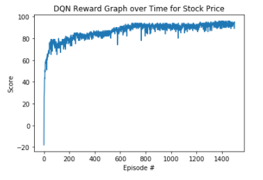
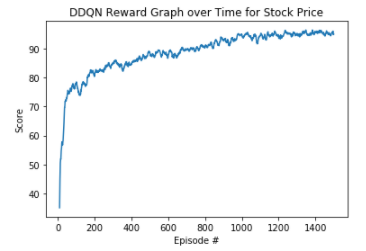
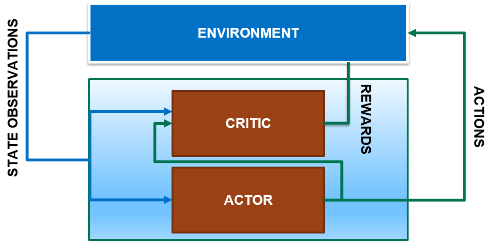

# Framework for DQN/DDQN showcase on stock trading
Using Deep reinforcement learning (DRL) agent to learn from historical data.

This framework can be used for other real life problem with environment setup to replace on StockMarketEnv() function. 
Please feel free to use it for your own use cases.

To learn more about the differences between DQN and DDQN Minh et al. 2015 : https://arxiv.org/pdf/1509.06461.pdf

Credit to developer at Kaggle for the initial written logic: https://www.kaggle.com/itoeiji/deep-reinforcement-learning-on-stock-data


Library use :
Pytorch and Python3

go to the official website: http://pytorch.org/

1. Select Windows as your operating system
2. Select your Package Manager such as pip or conda
3. Select you python version
4. Select CUDA or choose none You will get the command that will install pytorch on your system based on your selection.
5. For example, if you choose Windows, pip, python 3.6 and none in the listed steps, you will get the following commands:

```
pip3 install http://download.pytorch.org/whl/cpu/torch-0.4.0-cp36-cp36m-win_amd64.whl 
pip3 install torchvision
```

### Results

Deep Q-Network runs on BAUTO stock in KLSE (Malaysia Stock Exchange) over 1500 episodes.


DoubleDeep Q-Network runs on BAUTO stock in KLSE (Malaysia Stock Exchange) over 1500 episodes.


### Next Step
```
1. Using saved model from DQN or DDQN to load multiple different stock with train and test set in Malaysia KLSE stock market as reference - estimated completion by November15 2020
2. Implement prioritized replay and dueling DQN as benchmark - estimated completion by December 1st 2020
3. Current action is on discrete state 0 for hold , 1 for buy and 2 for sell call - Using DQN . Transition to Policy Gradient for continuous action space -  estimated completion by January 1st 2021.
  b. Will upload Policy Gradient code in Policy Gradient in Policy_Gradient folder for future development.
```


## Deal with continuous space (Taken from udacity deep learning notebook)

### Actor-Critic Methods

In reinforcement learning, an agent makes observations and takes actions within an environment, and in return it receives rewards. Its objective is to learn to act in a way that will maximize its expected long-term rewards. 

<br>
<figure>
  
      <figcaption style = "text-align: center; font-style: italic">Fig 1. - Reinforcement Learning.</figcaption>
</figure> 
<br>

There are several types of RL algorithms, and they can be divided into three groups:

- **Critic-Only**: Critic-Only methods, also known as Value-Based methods, first find the optimal value function and then derive an optimal policy from it. 


- **Actor-Only**: Actor-Only methods, also known as Policy-Based methods, search directly for the optimal policy in policy space. This is typically done by using a parameterized family of policies over which optimization procedures can be used directly. 


- **Actor-Critic**: Actor-Critic methods combine the advantages of actor-only and critic-only methods. In this method, the critic learns the value function and uses it to determine how the actor's policy parramerters should be changed. In this case, the actor brings the advantage of computing continuous actions without the need for optimization procedures on a value function, while the critic supplies the actor with knowledge of the performance. Actor-critic methods usually have good convergence properties, in contrast to critic-only methods.  The **Deep Deterministic Policy Gradients (DDPG)** algorithm is one example of an actor-critic method.

<br>
<figure>
  
      <figcaption style = "text-align: center; font-style: italic">Fig 2. - Actor-Critic Reinforcement Learning.</figcaption>
</figure> 
<br>

In this notebook, we will use DDPG to determine the optimal execution of portfolio transactions. In other words, we will use the DDPG algorithm to solve the optimal liquidation problem. But before we can apply the DDPG algorithm we first need to formulate the optimal liquidation problem so that in can be solved using reinforcement learning. In the next section we will see how to do this. 
